# Diagrammes d'Architecture - A-Level Saver

Ce document contient les diagrammes Mermaid décrivant l'architecture et les flux du système A-Level Saver.

**Version 2.2** - Inclut l'architecture Multi-Intention et Multi-État, wildcards matrix, date_utils centralisé.

---

## 1. Vue d'Ensemble de l'Architecture

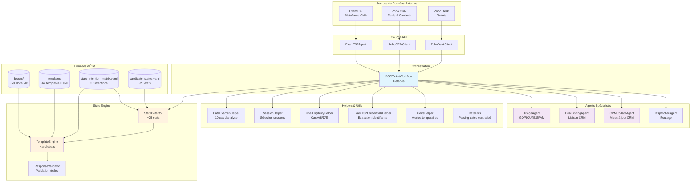

---

## 2. Workflow Principal - Traitement des Tickets DOC

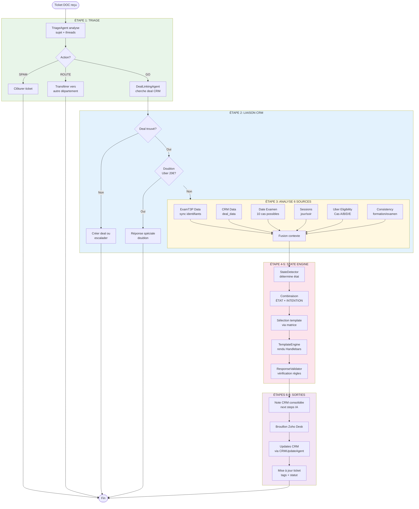

---

## 3. Machine à États - Détection d'État du Candidat

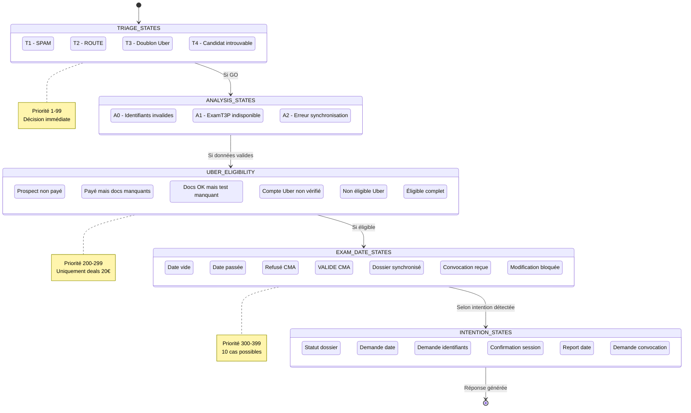

---

## 4. Flux de Données - De la Source au Template

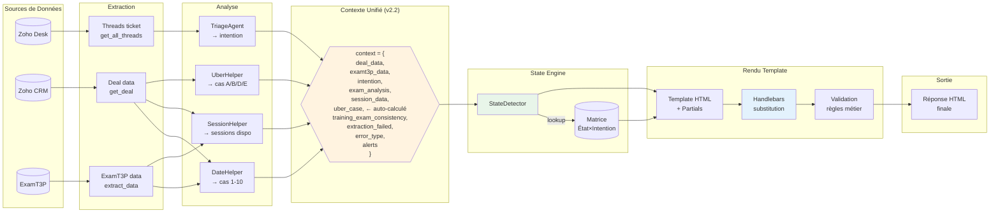

---

## 5. Cas Uber 20€ - Arbre de Décision

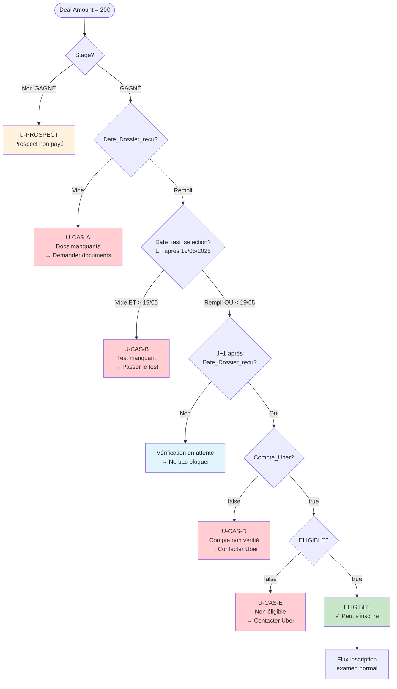

---

## 6. Agents et Leurs Responsabilités

```mermaid
graph TB
    subgraph "Agents IA (Claude)"
        TA[<b>TriageAgent</b><br/>━━━━━━━━━━━━<br/>• Classifie GO/ROUTE/SPAM<br/>• Détecte intention I01-I37<br/>• Extrait contexte urgence<br/>• Préférence session jour/soir]

        DLA[<b>DealLinkingAgent</b><br/>━━━━━━━━━━━━<br/>• Lie ticket → deal CRM<br/>• Détecte doublons Uber<br/>• Récupère deal_data<br/>• Gère cas multi-deals]

        CUA[<b>CRMUpdateAgent</b><br/>━━━━━━━━━━━━<br/>• Mapping string → ID<br/>• Règles de blocage<br/>• Updates sécurisés<br/>• Logging automatique]

        ETA[<b>ExamT3PAgent</b><br/>━━━━━━━━━━━━<br/>• Extraction données CMA<br/>• Statut dossier<br/>• Documents/paiements<br/>• HTTP extraction]
    end

    subgraph "Helpers Fonctionnels"
        DEH[<b>DateExamenHelper</b><br/>━━━━━━━━━━━━<br/>• 10 cas de date<br/>• Dates alternatives<br/>• Filtrage par région<br/>• Règles de blocage]

        SH[<b>SessionHelper</b><br/>━━━━━━━━━━━━<br/>• Sessions jour/soir<br/>• Auto-sélection<br/>• Proposition options<br/>• Matching date→session]

        UEH[<b>UberEligibilityHelper</b><br/>━━━━━━━━━━━━<br/>• Cas A/B/D/E<br/>• Vérification timing<br/>• Messages adaptés<br/>• Règles de blocage]

        ECH[<b>CredentialsHelper</b><br/>━━━━━━━━━━━━<br/>• Extraction via IA<br/>• Validation connexion<br/>• Source CRM/threads<br/>• Gestion double compte]

        DUH[<b>DateUtils</b> ⭐ NEW<br/>━━━━━━━━━━━━<br/>• Parsing multi-format<br/>• parse_date_flexible<br/>• format_date_for_display<br/>• Comparaisons dates]
    end

    TA --> |intention| WF[DOCTicketWorkflow]
    DLA --> |deal_data| WF
    CUA --> |updates| WF
    ETA --> |examt3p_data| WF

    DEH --> |exam_analysis| WF
    SH --> |session_data| WF
    UEH --> |uber_case| WF
    ECH --> |credentials| WF

    style TA fill:#e1bee7
    style DLA fill:#e1bee7
    style CUA fill:#e1bee7
    style ETA fill:#e1bee7
    style DEH fill:#b3e5fc
    style SH fill:#b3e5fc
    style UEH fill:#b3e5fc
    style ECH fill:#b3e5fc
    style WF fill:#c8e6c9
```

---

## 7. Template Engine - Sélection et Rendu

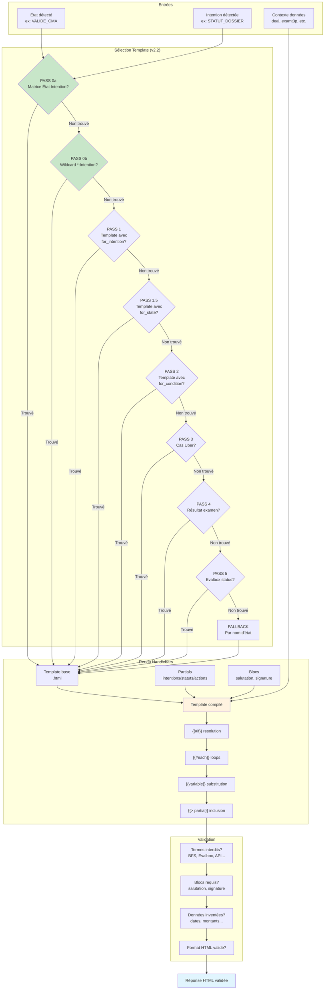

---

## 8. Synchronisation ExamT3P ↔ CRM

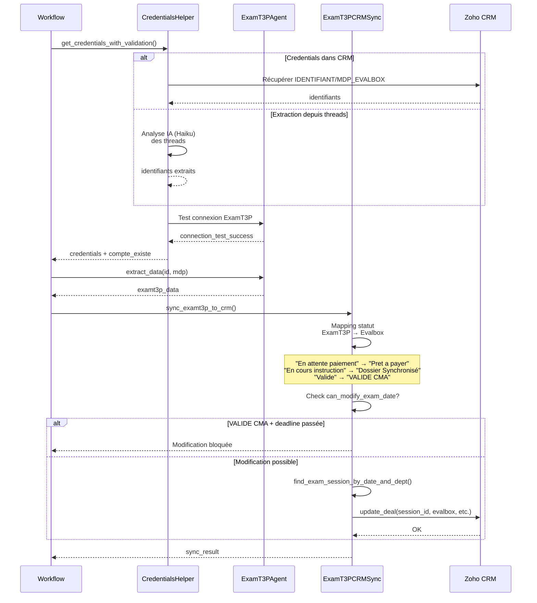

---

## 9. Architecture Modulaire des Templates

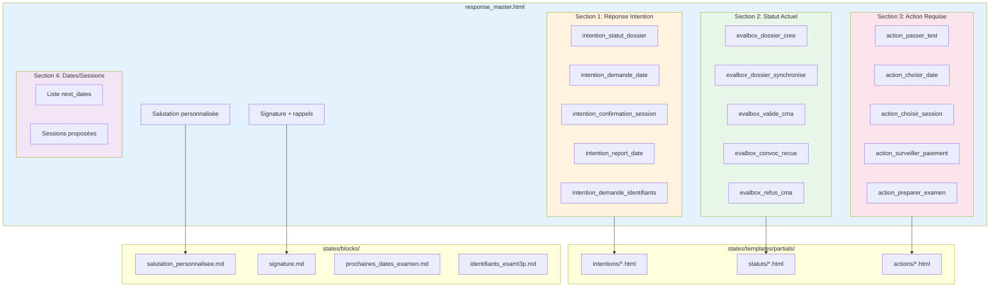

---

## 10. Cycle de Vie d'un Ticket DOC

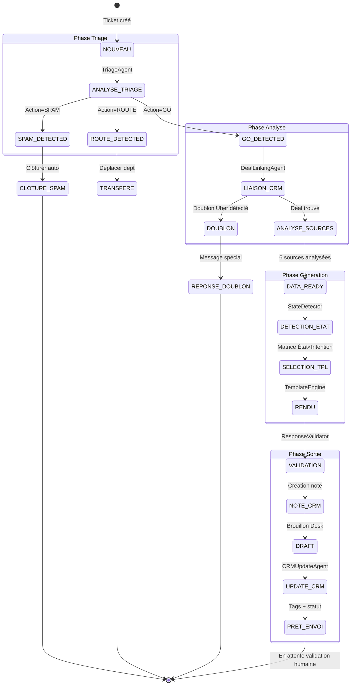

---

## 11. Intentions Détectées par TriageAgent (I01-I37)

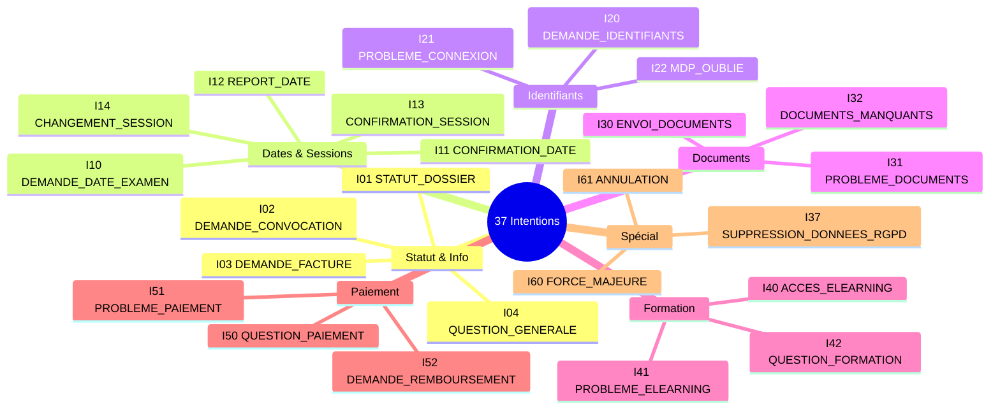

---

## 12. Règles de Blocage - Modification Date Examen

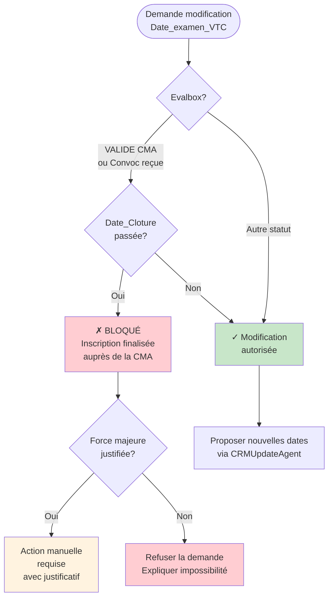

---

## 13. Stack Technologique

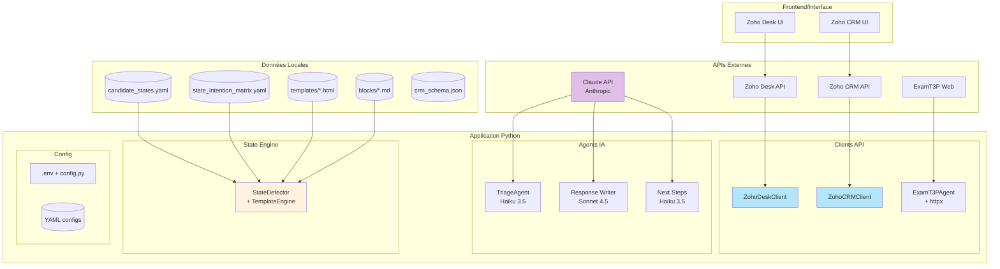

---

## Légende

| Couleur | Signification |
|---------|---------------|
| 🟢 Vert clair | Flux principal / OK |
| 🔵 Bleu clair | Données / APIs |
| 🟡 Jaune/Orange | Analyse / Traitement |
| 🟣 Violet | IA / Agents Claude |
| 🔴 Rouge clair | Blocage / Erreur |
| ⬜ Gris | Éléments neutres |
| ⭐ NEW | Nouveautés v2.2 |

---

## 14. Architecture Multi-Intention (v2.1)

Le TriageAgent détecte une **intention principale** + des **intentions secondaires** pour les messages complexes.

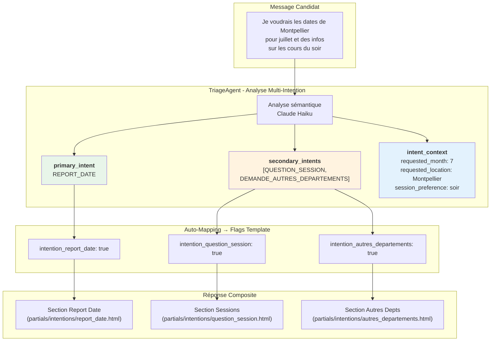

### Intentions Supportées

| Intention | Flag Template | Description |
|-----------|---------------|-------------|
| `STATUT_DOSSIER` | `intention_statut_dossier` | Demande d'avancement |
| `DEMANDE_DATES_FUTURES` | `intention_demande_date` | Dates disponibles |
| `REPORT_DATE` | `intention_report_date` | Changement de date |
| `QUESTION_SESSION` | `intention_question_session` | Infos jour/soir |
| `DEMANDE_AUTRES_DEPARTEMENTS` | `intention_autres_departements` | Dates autres villes |
| `QUESTION_PROCESSUS` | `intention_question_processus` | Étapes d'inscription |
| `CONFIRMATION_SESSION` | `intention_confirmation_session` | Confirme son choix |

---

## 15. Architecture Multi-État - Severity System (v2.1)

Les états sont classifiés par **severity** pour déterminer leur comportement dans le workflow.

```mermaid
flowchart TD
    subgraph DETECTION["StateDetector.detect_all_states()"]
        direction TB
        EVAL[Évaluation de tous<br/>les états par priorité]
    end

    EVAL --> BLOCKING
    EVAL --> WARNING
    EVAL --> INFO

    subgraph BLOCKING["🚫 BLOCKING States"]
        direction TB
        B1[SPAM]
        B2[DUPLICATE_UBER]
        B3[UBER_DOCS_MISSING]
        B4[UBER_TEST_MISSING]
        B5[UBER_PROSPECT]
        B6[DOUBLE_ACCOUNT_PAID]
        NOTE_B["<i>Stoppe le workflow<br/>Réponse unique</i>"]
    end

    subgraph WARNING["⚠️ WARNING States"]
        direction TB
        W1[UBER_ACCOUNT_NOT_VERIFIED]
        W2[UBER_NOT_ELIGIBLE]
        W3[DATE_MODIFICATION_BLOCKED]
        W4[TRAINING_MISSED_EXAM_IMMINENT]
        W5[PERSONAL_ACCOUNT_WARNING]
        NOTE_W["<i>Ajoute alerte<br/>Workflow continue</i>"]
    end

    subgraph INFO["ℹ️ INFO States"]
        direction TB
        I1[EXAM_DATE_EMPTY]
        I2[VALIDE_CMA_WAITING_CONVOC]
        I3[DOSSIER_SYNCHRONIZED]
        I4[CONVOCATION_RECEIVED]
        I5[REPORT_DATE_REQUEST]
        NOTE_I["<i>Combinables<br/>Réponse composite</i>"]
    end

    BLOCKING --> |"Si trouvé"| STOP([Arrêt workflow<br/>Réponse BLOCKING])
    WARNING --> |"Collectés"| CONTINUE
    INFO --> |"Combinés"| CONTINUE

    CONTINUE[generate_response_multi<br/>Contexte combiné] --> OUTPUT([Réponse composite<br/>avec alertes WARNING])

    style BLOCKING fill:#ffcdd2
    style WARNING fill:#fff3e0
    style INFO fill:#e8f5e9
    style STOP fill:#ef9a9a
    style OUTPUT fill:#c8e6c9
```

### Structure DetectedStates (v2.2)

```python
@dataclass
class DetectedStates:
    blocking_state: Optional[DetectedState]  # Premier BLOCKING (arrête tout)
    warning_states: List[DetectedState]      # Alertes à inclure
    info_states: List[DetectedState]         # États combinables
    primary_state: DetectedState             # blocking > premier info
    all_states: List[DetectedState]          # Debug

# Contexte enrichi automatiquement (v2.2):
context = {
    'uber_case': 'A' | 'B' | 'D' | 'E' | 'ELIGIBLE' | None,  # Auto-calculé
    'extraction_failed': bool,     # True si ExamT3P indisponible
    'error_type': str | None,      # Type d'erreur
    'session_data': dict,          # Données sessions
    'training_exam_consistency_data': dict,  # Cohérence formation
    # ... autres données du contexte
}
```

---

## 16. Flux de Génération Multi-État/Multi-Intention

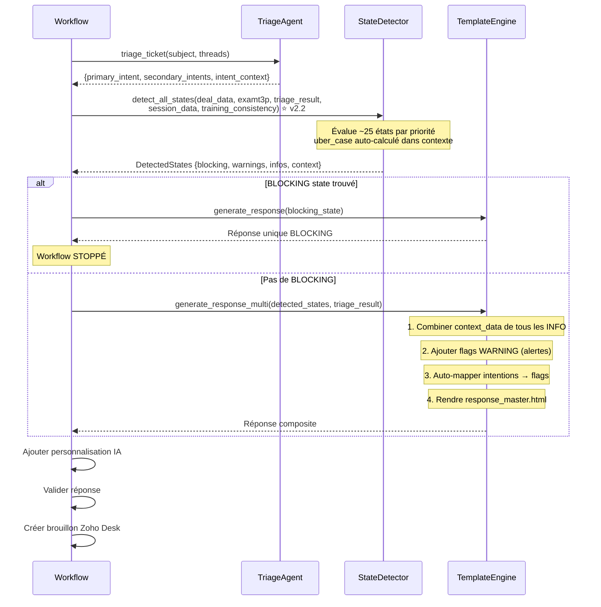

---

## 17. Template Master - Composition des Sections (v2.1)

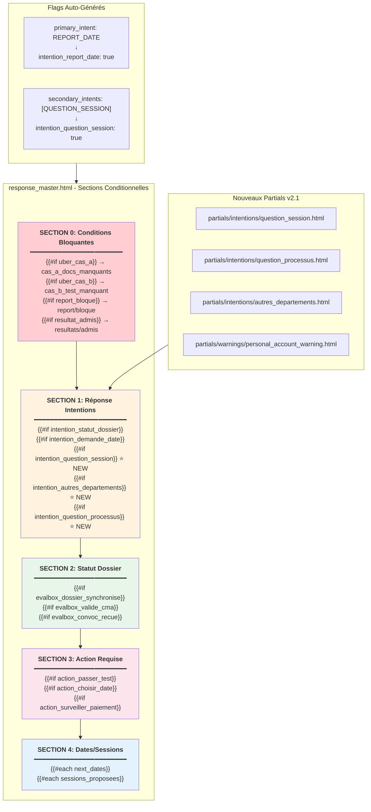

---

## 18. Exemple Complet - Multi-Intention + Multi-État

```mermaid
flowchart LR
    subgraph INPUT["Entrée"]
        MSG["Candidat: 'Je voudrais<br/>reporter ma date à juillet<br/>et avoir des infos sur<br/>les cours du soir'<br/><br/>Date actuelle: 31/03/2026<br/>Evalbox: VALIDE CMA"]
    end

    subgraph TRIAGE["Triage"]
        T_OUT["primary: REPORT_DATE<br/>secondary: [QUESTION_SESSION]<br/>context:<br/>  requested_month: 7<br/>  session_preference: soir"]
    end

    subgraph STATES["États Détectés"]
        S_BLOCK["🚫 BLOCKING: null"]
        S_WARN["⚠️ WARNING:<br/>[DATE_MODIFICATION_BLOCKED]"]
        S_INFO["ℹ️ INFO:<br/>[VALIDE_CMA_WAITING_CONVOC]"]
    end

    subgraph FLAGS["Flags Combinés"]
        FL["intention_report_date: true<br/>intention_question_session: true<br/>report_bloque: true<br/>evalbox_valide_cma: true"]
    end

    subgraph OUTPUT["Réponse Générée"]
        O1["Section Report Bloqué<br/>'Votre date ne peut pas<br/>être modifiée car votre<br/>dossier est validé...'"]
        O2["Section Sessions<br/>'Concernant les cours du<br/>soir, nous proposons...'"]
        O3["Section Statut<br/>'Statut: VALIDE CMA'"]
    end

    INPUT --> TRIAGE --> STATES --> FLAGS --> OUTPUT

    style S_BLOCK fill:#c8e6c9
    style S_WARN fill:#fff3e0
    style S_INFO fill:#e3f2fd
```

---

## Légende

| Couleur | Signification |
|---------|---------------|
| 🟢 Vert clair | Flux principal / OK / INFO |
| 🔵 Bleu clair | Données / APIs |
| 🟡 Jaune/Orange | Analyse / WARNING |
| 🟣 Violet | IA / Agents Claude |
| 🔴 Rouge clair | Blocage / BLOCKING |
| ⬜ Gris | Éléments neutres |

---

---

## 19. Module DateUtils - Parsing Centralisé (v2.2)

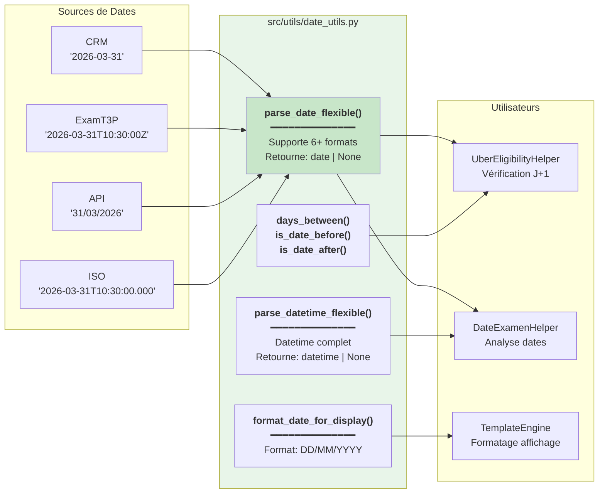

### Formats Supportés (ordre de priorité)

| Format | Exemple | Source typique |
|--------|---------|----------------|
| `%Y-%m-%d` | 2026-03-31 | CRM, API |
| `%Y-%m-%dT%H:%M:%S` | 2026-03-31T10:30:00 | API |
| `%Y-%m-%dT%H:%M:%S.%f` | 2026-03-31T10:30:00.000 | API |
| `%Y-%m-%dT%H:%M:%SZ` | 2026-03-31T10:30:00Z | ExamT3P |
| `%d/%m/%Y` | 31/03/2026 | Affichage FR |
| `%d-%m-%Y` | 31-03-2026 | Import legacy |

---

## 20. STATE_FLAG_MAP - Mapping États → Flags Template (v2.2)

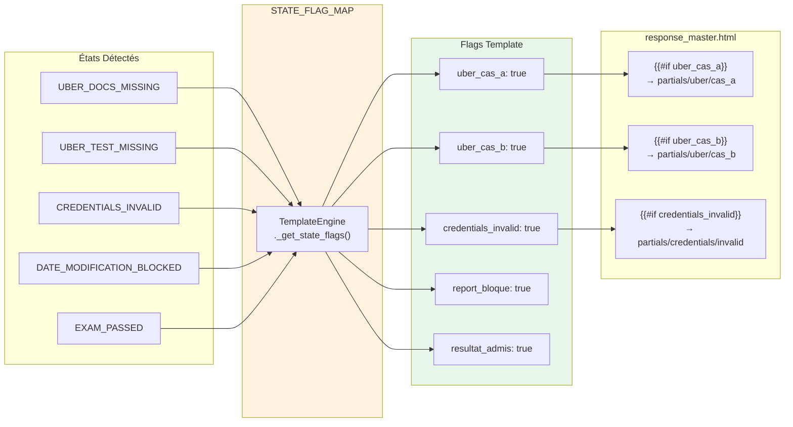

### Mapping Complet (20+ états)

| État | Flags Template |
|------|----------------|
| `UBER_DOCS_MISSING` | `uber_cas_a` |
| `UBER_TEST_MISSING` | `uber_cas_b` |
| `UBER_ACCOUNT_NOT_VERIFIED` | `uber_cas_d` |
| `UBER_NOT_ELIGIBLE` | `uber_cas_e` |
| `DUPLICATE_UBER` | `uber_doublon` |
| `CREDENTIALS_INVALID` | `credentials_invalid` |
| `CREDENTIALS_UNKNOWN` | `credentials_inconnus` |
| `DATE_MODIFICATION_BLOCKED` | `report_bloque` |
| `REPORT_DATE_REQUEST` | `report_possible` |
| `FORCE_MAJEURE_REPORT` | `report_force_majeure` |
| `EXAM_PASSED` | `resultat_admis` |
| `EXAM_FAILED` | `resultat_non_admis` |
| `EXAM_ABSENT` | `resultat_absent` |

---

## Changelog Architecture

### v2.2 (Janvier 2026)
- **DateUtils** : Nouveau module centralisé pour parsing de dates multi-format
- **Wildcards Matrix** : Support `*:INTENTION` pour templates génériques (PASS 0b)
- **uber_case en contexte** : Calculé automatiquement dans `_build_context()`
- **Paramètres enrichis** : `session_data` et `training_exam_consistency_data` dans `detect_all_states()`
- **STATE_FLAG_MAP complet** : 20+ états mappés vers flags template
- **extraction_failed/error_type** : Flags pour détection EXAMT3P_DOWN
- **Templates .html** : Tous les templates référencent `.html` (plus de `.md`)
- **Section states: dépréciée** : Source de vérité unique = `candidate_states.yaml`

### v2.1 (Décembre 2025)
- Architecture Multi-Intention (primary + secondary intents)
- Architecture Multi-État (BLOCKING/WARNING/INFO severity)
- Template master modulaire avec partials

---

*Généré automatiquement depuis l'analyse du codebase A-Level Saver - v2.2 Multi-Intention/Multi-État + DateUtils + Wildcards*
